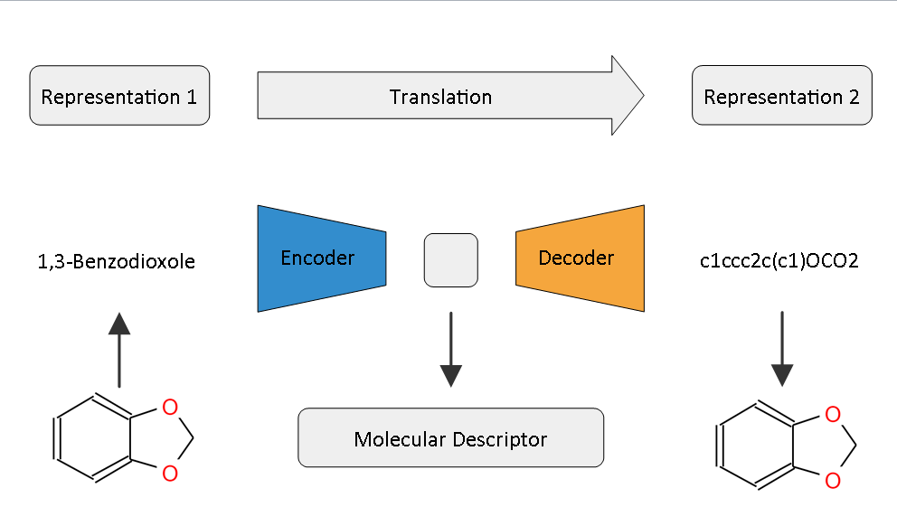

# torch_cddd
PyTorch implementation of the Paper "Learning Continuous and Data-Driven Molecular
Descriptors by Translating Equivalent Chemical Representations" by Robin Winter, Floriane Montanari, Frank Noe and Djork-Arne Clevert.1

### References
[1] R. Winter, F. Montanari, F. Noe and D. Clevert, Chem. Sci, 2019, https://pubs.rsc.org/en/content/articlelanding/2019/sc/c8sc04175j#!divAbstract
